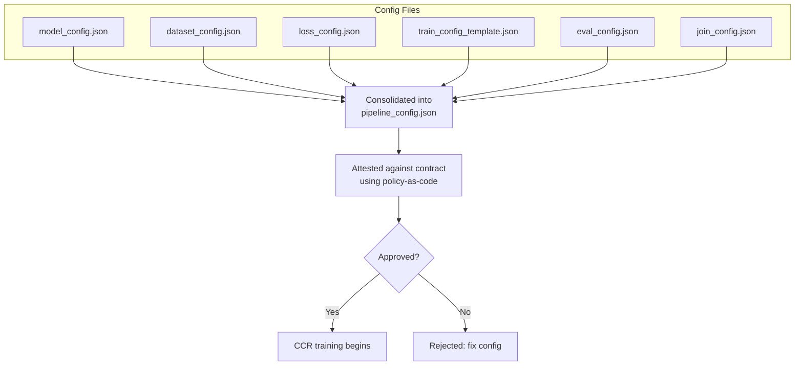

# Oral Cytology Nucleus Segmentation

## Scenario Type

| Scenario name | Scenario type | Task type | Privacy | No. of TDPs | Data type (format) | Model type (format) | Join type (No. of datasets) |
|---------------|---------------|-----------|---------|-------------|---------------------|---------------------|-----------------------------|
| Oral Cytology | Training - Deep Learning | Binary image segmentation (nuclei) | DP-ready (off by default) | 2 | RGB cytology tiles + GeoJSON annotations (PNG) | UNet (Safetensors) | Horizontal (2) |

---

## Scenario Description

This scenario trains a U-Net to segment cell nuclei on oral cytology tiles, with the
dataset partitioned across multiple source centers. Each Training Data Provider (TDP)
holds the slides from a subset of centers; the Training Data Consumer (TDC) builds a
model on the joined data inside a Confidential Clean Room (CCR). Differential privacy
(DP-SGD) is **wired but disabled by default** — see [Privacy properties](#privacy-properties).

The end-to-end training pipeline consists of:

1. Data pre-processing (per TDP: rasterize GeoJSON polygons to binary masks)
2. Data packaging, encryption, and upload
3. Model packaging, encryption, and upload
4. Encryption key import with key release policies
5. Deployment and execution of CCR
6. Trained model decryption

The source dataset is
[`abhijeetptl5/oral-cytology-dataset`](https://www.kaggle.com/datasets/abhijeetptl5/oral-cytology-dataset)
on Kaggle (RGB cytology tiles + per-tile GeoJSON polygon annotations).

## TDP partitioning

Samples are grouped into two TDPs by source-center prefix (first two characters of each
filename):

| TDP | Centers | Samples |
|---|---|---|
| `oral_cyto_A` | 11, 02, 03 | 349 |
| `oral_cyto_B` | 12, 06, 07, 10 | 390 |

The Kaggle dataset uses 2-digit numeric prefixes to identify source centers but does
not publish the explicit prefix-to-hospital mapping. The paper (arXiv:2506.06990)
Table 1 lists the 10 contributing centers; we partition by prefix groupings without
claiming specific hospital identities. The resulting TDPs are defensible as
inter-center splits (no overlap, all from distinct sources) even without named-center
attribution.

Each TDP's raw data should be placed under `data/<tdp>/` as a flat collection of paired
`<sample>.png` (RGB tile) and `<sample>.geojson` (polygon annotations) files. Each TDP's
preprocess container filters by its center set and rasterizes each GeoJSON into a
matching `<sample>_seg.png` binary mask.

## Build container images

```bash
export SCENARIO=oral_cyto
export REPO_ROOT="$(git rev-parse --show-toplevel)"
cd $REPO_ROOT/scenarios/$SCENARIO
./ci/build.sh
```

This builds:

- `preprocess-oral-cyto-a`, `preprocess-oral-cyto-b`: per-TDP preprocess containers (center filtering + GeoJSON→mask rasterization)
- `oral-cyto-model-save`: container that initializes and saves the base model

## Data pre-processing

Place each TDP's slice of the Kaggle dataset under `data/oral_cyto_A/` and
`data/oral_cyto_B/` (PNG + GeoJSON files for that TDP's centers). Then:

```bash
cd $REPO_ROOT/scenarios/$SCENARIO/deployment/local
./preprocess.sh
```

Each preprocess container:

1. Iterates the input directory for `*.geojson` files.
2. Filters by the first-2-character center prefix.
3. For each matching pair, rasterizes the polygons to a binary mask and writes a per-sample folder
   `data/<tdp>/preprocessed/oral_cyto_<sample_id>/` containing `<...>_img.png` and `<...>_seg.png`.

Patches are downsampled from 2048×2048 to 256×256 during preprocessing
(`cv2.INTER_AREA` for images, `cv2.INTER_NEAREST` for binary masks) to make
CPU-only training tractable. This loses fine-grained nucleus shape detail
but preserves the segmentation task at slide-region scale.

The resulting layout is what `config/dataset_config.json` expects via its
`folder_pattern + input_pattern + target_pattern` triple.

## Prepare base model

```bash
./save-model.sh
```

Loads [config/model_config.json](./config/model_config.json) (a declarative U-Net with 3-channel
RGB input and 1-channel sigmoid mask output), instantiates via the framework's
[`ModelFactory`](./src/model_constructor.py), and writes the initial weights to
[modeller/models/model.safetensors](./modeller/models/).

## Deploy locally

> **Prerequisite:** this scenario depends on the `depa-training:latest`
> framework image, which doesn't ship pre-built. From the repo root:
>
> ```bash
> cd src/train && python3 setup.py bdist_wheel && cd -
> docker build -f ci/Dockerfile.train -t depa-training:latest src
> ```

```bash
./train.sh
```

This runs `config/consolidate_pipeline.sh` to assemble the
[pipeline_config.json](./config/pipeline_config.json) from the hand-authored configs:



The training pipeline:

1. `DirectoryJoin` — concatenates each TDP's `preprocessed/` directory into `/tmp/oral_cyto_joined/`.
2. `Train_DL` — trains the U-Net on the joined dataset (DP-SGD off by default; see
   [Privacy properties](#privacy-properties)), saves trained weights as Safetensors, and
   emits evaluation metrics (dice, jaccard, hausdorff).

Outputs are written to [modeller/output/](./modeller/output/).

If all goes well, you should see output similar to the following, and
the trained model and evaluation metrics will be saved under
`modeller/output/`:

```text
train-1  | Merged dataset 'Oral_Cytology_set_A' into '/tmp/oral_cyto_joined'
train-1  | Merged dataset 'Oral_Cytology_set_B' into '/tmp/oral_cyto_joined'
train-1  | Loaded dataset splits | train: 517 | val: 148 | test: 74
train-1  | Custom model loaded from PyTorch config
train-1  | Optimizer Adam loaded from config
train-1  | Scheduler CyclicLR loaded from config
train-1  | Custom loss function loaded from config
train-1  | Epoch 1/1 completed | Training Loss: 1.6817
train-1  | Epoch 1/1 completed | Validation Loss: 1.3570
train-1  | Saving trained model to /mnt/remote/output/trained_model.safetensors
train-1  | Evaluation Metrics: {'test_loss': 1.3549, 'dice_score': 1.96e-05, 'jaccard_index': 9.82e-06, 'hausdorff_distance': 127.0}
train-1  | CCR Training complete!
```

The 1-epoch smoke run produces near-zero segmentation metrics
(`dice_score` ~2e-5), consistent with the model collapsing to an
all-zero prediction on heavily class-imbalanced data (~1% positive
pixels). This is expected — the default config prioritizes a fast
end-to-end pipeline test over accuracy. For meaningful training,
increase `total_epochs` in `config/templates/train_config_template.json`
(50-100 epochs is a reasonable starting point) and consider a
class-weighted or focal loss variant for the severe imbalance.

## Privacy properties

Differential privacy (DP-SGD via Opacus) is **wired but disabled by default**. The
[train_config_template.json](./config/templates/train_config_template.json) ships with:

```json
"is_private": false,
"privacy_params": {
    "max_grad_norm": 1.0,
    "epsilon": 8.0,
    "delta": 1e-5
}
```

This scenario uses CCR isolation only; differential privacy is not used. The contract declares no privacy constraints and training runs with `is_private: false`. To add DP, both the contract and `train_config_template` must be updated together (the CCR policy enforces that contract-declared bounds and `train_config` DP-on travel as a pair).

To enable DP, flip `is_private` to `true` and re-run
[config/consolidate_pipeline.sh](./config/consolidate_pipeline.sh) (or
`deployment/local/train.sh`, which calls it). The harness reads `is_private` and the
three `privacy_params` keys above; see
[src/train/pytrain/dl_train.py:79-186](../../src/train/pytrain/dl_train.py). The
default `epsilon=8.0` / `delta=1e-5` is a moderate privacy budget — tighten
`epsilon` to make the guarantee stronger (at the cost of utility) and keep `delta`
well below `1/N` where `N` is the training-set size.

## Deploy on CCR

Phase 2 work. The [deployment/azure/](./deployment/azure/) directory currently mirrors the
BraTS scaffolding as a placeholder — values are not customized for this scenario yet. Do
not run those scripts until they have been adapted.

See [CLAUDE.md](./CLAUDE.md) for the locked design decisions and the lifted-code map.

## References

[1] Jain, G. et al. "A Cytology Dataset for Early Detection of Oral Squamous Cell Carcinoma." arXiv preprint arXiv:2506.06990 (2025).

[2] Oral Cytology Dataset, Kaggle: https://www.kaggle.com/datasets/abhijeetptl5/oral-cytology-dataset

[3] Patil, A. et al. oral_cyto_dataset — reference training code: https://github.com/abhijeetptl5/oral_cyto_dataset
